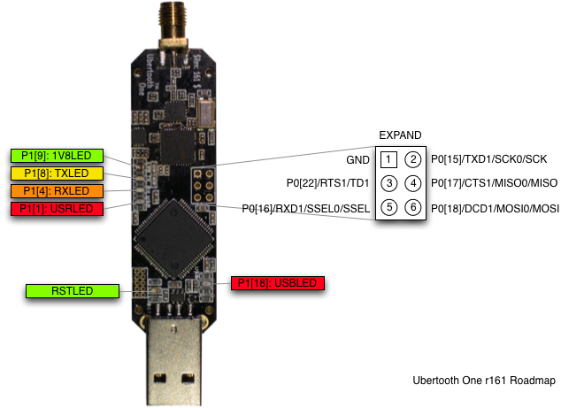

=============
Ubertooth One
=============

Ubertooth One is the hardware platform of Project Ubertooth. It supersedes `Ubertooth Zero <https://github.com/greatscottgadgets/ubertooth/wiki/Ubertooth-Zero>`__ and is currently the preferred platform.

	.. image:: ../images/ubertooth-one.jpeg

Architecture
~~~~~~~~~~~~

* `RP-SMA <http://en.wikipedia.org/wiki/SMA_connector>`__ RF connector: connects to test equipment, antenna, or dummy load.

* `CC2591 <http://www.ti.com/product/cc2591>`__ RF front end.

* `CC2400 <http://www.ti.com/product/cc2400>`__ wireless transceiver.

* `LPC175x <http://www.nxp.com/products/microcontrollers-and-processors/arm-processors/lpc-cortex-m-mcus/lpc1700-cortex-m3:MC_1403790745385>`__ ARM Cortex-M3 microcontroller with Full-Speed USB 2.0.

* USB A plug: connects to host computer running Kismet or other host code.

Features
~~~~~~~~

* 2.4 GHz transmit and receive.

* Transmit power and receive sensitivity comparable to a Class 1 Bluetooth device.

* Standard `Cortex Debug Connector <http://infocenter.arm.com/help/topic/com.arm.doc.faqs/attached/13634/cortex_debug_connectors.pdf>`__ (10-pin 50-mil JTAG).

* In-System Programming (ISP) serial connector.

* Expansion connector: intended for inter-Ubertooth communication or other future uses.

* Six indicator LEDs.

Design
~~~~~~

Ubertooth One was designed in `KiCad <http://www.kicad-pcb.org/>`__, an open source electronic design automation software package, with surface mount components suitable for `reflow <http://www.sparkfun.com/tutorials/59>`__.

Pins and LEDs
^^^^^^^^^^^^^

This diagram shows the location of LEDs and the pins of the expansion connector.

LED guide:

    * RST: indicates that the LPC175x is powered on. This should always be on during operation except during a full reset of the LPC175x (e.g., while entering ISP mode).

    * 1V8: indicates that the CC2400 is being supplied with 1.8 V. Control of this supply depends on firmware. 1V8 power is required to activate the crystal oscillator which is required to activate USB.

    * USB: indicates that USB has passed enumeration and configuration.

    * TX: Control of this LED depends on firmware. It typically indicates radio transmission.

    * RX: Control of this LED depends on firmware. It typically indicates radio reception.

    * USR: Control of this LED depends on firmware.

The TX, RX, and USR LEDs blink in a distinctive chasing pattern when the bootloader is ready to accept USB DFU commands.

Power Usage
^^^^^^^^^^^

These measurements were taken using Ubertooth One running firmware revision 2014-02-R2. Zero_Chaos took these measurements using a Centech CT-USB-PW, available via `eBay <http://www.ebay.com/itm/Century-JAPAN-USB-Power-Meter-voltage-measuring-instrument-Centech-CT-USB-PW-/151281911884>`__ and `others <http://store.mcetech.com/Merchant2/merchant.mvc?Screen=PROD&Product_Code=CT-USB-PW&Category_Code=USBPERIPH>`__.

Let's add another sentence.

.. list-table :: 
  :header-rows: 1
  :widths: 1 1 1

  * - Command
    - Description
    - Power draw (amps)
  * -
    - Idle
    - 0.09A
  * - ``ubertooth-dump``
    - Receive
    - 0.13A
  * - ``ubertooth-util -t``
    - Transmit
    - 0.22A
  * - ``ubertooth-dfu --write``
    - Firmware upgrade
    - 0.10A

Demonstration
^^^^^^^^^^^^^

Michael Ossmann presented `Project Ubertooth: Building a Better Bluetooth Adapter <http://www.shmoocon.org/schedule#ubertooth>`__ at `ShmooCon <http://www.shmoocon.org/>`__ 2011.