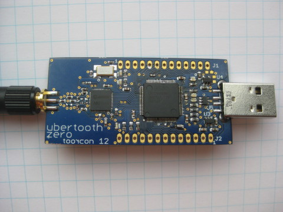

==============
Ubertooth Zero
==============

Ubertooth Zero was the first working prototype hardware platform of Project Ubertooth. It has been superseded by `Ubertooth One <https://github.com/greatscottgadgets/ubertooth/wiki/Ubertooth-One>`__.

Architecture
~~~~~~~~~~~~

* `RP-SMA <http://en.wikipedia.org/wiki/SMA_connector>`__ RF connector: connects to test equipment, antenna, or dummy load.

* `CC2400 <http://focus.ti.com/docs/prod/folders/print/cc2400.html>`__ wireless transceiver IC.

* `LPC175x <http://ics.nxp.com/products/lpc1000/lpc17xx/>`__ ARM Cortex-M3 microcontroller with Full-Speed USB 2.0.

* USB A plug: connects to host computer running Kismet or other host code.

Features
~~~~~~~~

* 2.4 GHz transmit and receive.

* Transmit power and receive sensitivity comparable to a Class 3 Bluetooth device.

* Non-standard JTAG connector.

* In-System Programming (ISP) serial connector.

* Expansion connector: intended for inter-Ubertooth communication or other future uses.

* Six indicator LEDs.

Design
~~~~~~

Ubertooth Zero was designed in `CadSoft EAGLE <http://www.cadsoft.de/>`__ with surface mount components suitable for `reflow <http://www.sparkfun.com/tutorials/59>`__.

Demonstration
~~~~~~~~~~~~~

Michael Ossmann presented Ubertooth Zero, a preview (video: part 1, part 2) at ToorCon 12 in October, 2010.